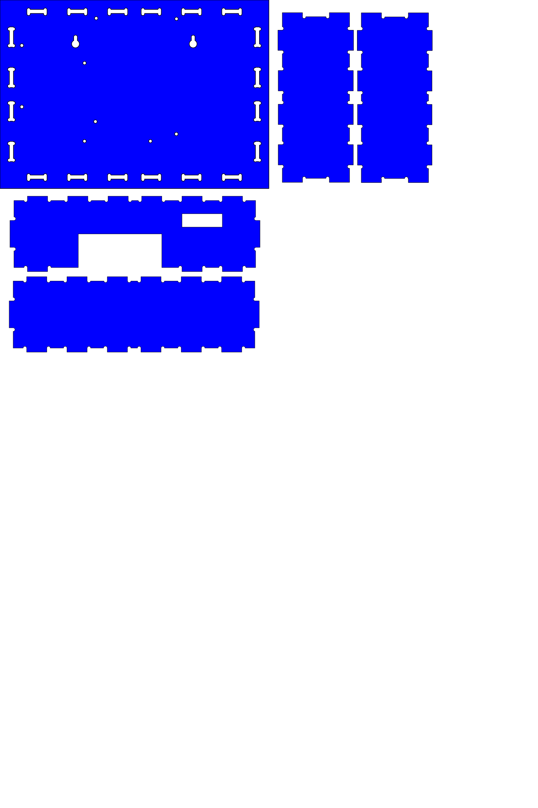
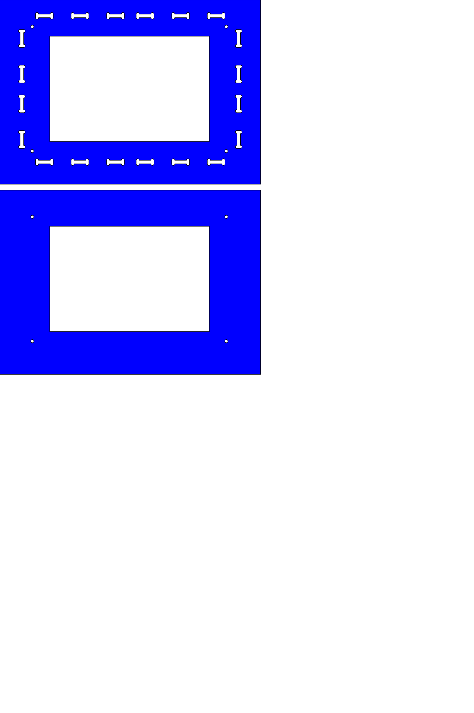

#files

All designs were created using [InkScape](https://www.inkscape.org/en/) and exported to `*.svg` and `*.dxf` formats.

1. **inital unmerged** contains the design of 6 sides of the enclosure before any merge or substraction

	
- **3mm** has the designs for base and 4 sides of the enclosure

	
- **2mm** has the designs for the top 2 acrylic pieces holding the LCD

	