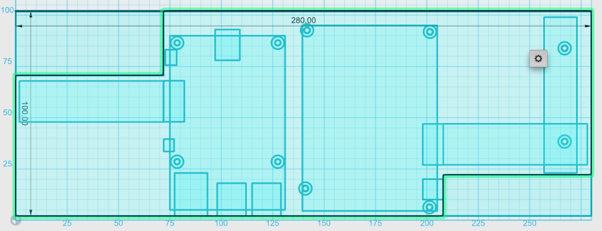

#RaspberryPI + LCD enclosure

This project contains the top and bottom parts of the enclosure housing:

1. [Raspberry PI Model B+](http://www.raspberrypi.org/product/model-b-plus/)
1. [LCD HDMI 5.6 inch](http://www.adafruit.com/products/1666)

Types of file included:

- `*.123dx` are 3D editable design file with [123D Design](http://www.123dapp.com/design)
- `*.stl` files are 3D design files

File explanations:

1. `base-bottom.123dx` - 2D projection of the bottom enclosure before 3D extrusion

	